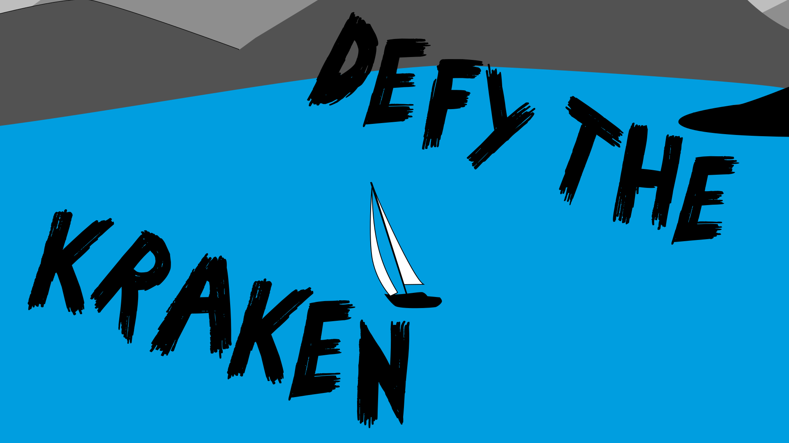

 defy the kraken
===================

A game to defy the kraken by repairing your ship and bring it to a safe harbor. Created during global game jam 2020.

 Global Game JAM
------------------
Hey, this Game is created by four People during the [Global Game Jam 2020](https://globalgamejam.org/2020/games).
Thank you [Toolbox Bodensee](https://toolbox-bodensee.de/) for the great Rooms and Equipment
and [Haite](https://www.haite.de/) for the Sponsored food.

The Global Game Jam is a 48Hour Game Jam where the World
Create Games for the World. 

 GAME IDEA
------------
Your ship is under attack by a wild seamonster. You have to prevent the ship from sinking. Repair the holes and pump the water out!
Hurry and you will arrvive at the shore savely. 

 CONTROLS
------------
A / SPACE : interacte
arrow keys / cursor keys : move

 ENGINE
-----------
This game is under Developing right now (During the Global Game Jam 2020)
with the GODOT Game Engine [Donwload - Godot](https://godotengine.org/download/linux)

 LICENSE
-----------
defy-the-kraken game (c) by Frogbeerr, Zitroanen, L3D and Yani

defy-the-kraken game is licensed under a
Creative Commons Attribution-NonCommercial-ShareAlike 4.0 International License.

You should have received a copy of the license along with this
work. If not, see <http://creativecommons.org/licenses/by-nc-sa/4.0/>.

### FONTS - USED
how-to-do-something - licensed as Freeware, Non-Commercial.
Copyright © 2012 TattooWoo.com. All Rights Reserved. 
from <https://www.fontspace.com/jonathan-s-harris/how-to-do-something>

### GRAFIK - LAKE WITH SHIP
Freifunk Bodensee  - L3D - [MIT License](https://github.com/ffbsee/ffbsee-webseite/blob/master/LICENSE)
from ffbsee.net
